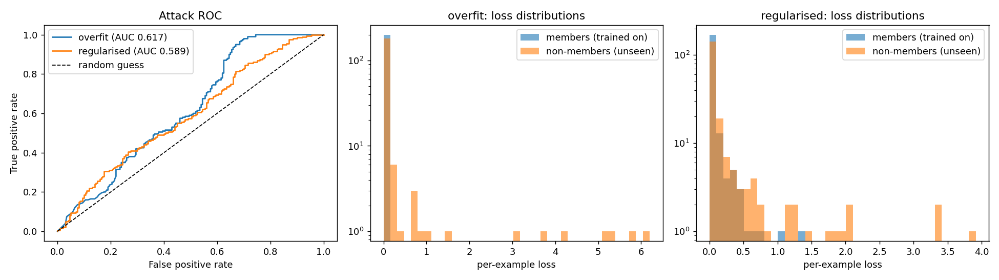

# Membership inference: does a model leak who was in its training data?

A small, reproducible PyTorch experiment on **privacy leakage** in trained models.

An attacker who can only query a trained model's outputs tries to guess whether a given
example was part of its training set. If they can, the model is leaking information about
its training data. That matters wherever training data is sensitive, for example records
held by public administrations.

## What it does

1. Splits a dataset into **members** (used for training) and **non-members** (never seen).
2. Trains a small neural network (2-layer MLP, PyTorch) on members only, under two regimes:
   - **overfit**: 200 training examples, 300 epochs, no regularisation
   - **regularised**: same 200 examples, dropout 0.5, weight decay, 40 epochs
3. Runs a **loss-threshold membership inference attack** (Yeom et al., 2018): examples with
   unusually low loss are guessed to be members.
4. Reports attack **AUC** (0.5 = random guessing) and **membership advantage**
   (max TPR − FPR over thresholds), plus train/test accuracy.

## Results (seed 0)

| Model | Train acc | Test acc | Attack AUC | Membership advantage |
|---|---|---|---|---|
| Overfit | 1.000 | 0.945 | 0.617 | 0.280 |
| Regularised | 0.990 | 0.922 | 0.589 | 0.145 |



## What I take from it

- **Both models leak.** Even the regularised model is above chance (AUC 0.59). Regularisation
  reduced the attacker's best-case advantage by about half (0.28 → 0.15), but did not remove it.
- **Leakage tracks the generalisation gap.** The overfit model's loss on members is almost zero
  (mean 0.0002) versus 0.21 on non-members.
- **A mean can mislead.** That large gap in mean loss does *not* translate into a strong attack
  (AUC only 0.62). The loss histograms show why: most non-members *also* get near-zero loss on
  this easy dataset, and the mean is pulled up by a handful of badly misclassified examples.
  The distributions, not the averages, decide how much an attacker can learn.
- Regularisation also cost some test accuracy here (0.945 → 0.922). This is the usual
  privacy/utility trade-off, in miniature.

## Limitations (please read before quoting any number)

- **One random seed.** Differences of a few AUC points could be noise; a proper version would
  repeat over many seeds and report confidence intervals.
- **Tiny, easy dataset** (scikit-learn digits, 8×8 images). Chosen because it is bundled with
  scikit-learn and runs offline on a laptop, not because it is realistic.
- **Weakest standard attack.** The loss-threshold attack is a baseline. Stronger attacks
  (shadow models, Shokri et al. 2017; likelihood-ratio attacks, Carlini et al. 2022) would
  likely find more leakage, especially at low false-positive rates, which is where the real
  privacy risk lies.
- **No formal guarantee.** Dropout and weight decay are not privacy defences. Differential
  privacy (e.g. DP-SGD via Opacus) is the principled comparison and the obvious next step.

## Run it

```bash
pip install -r requirements.txt
python mia.py
```

Runs on CPU in well under a minute. Writes `results.json` and `mia_results.png`.
Also works as-is in Google Colab.

## Next steps

- Repeat over 10+ seeds with confidence intervals
- Add a DP-SGD model (Opacus) and plot the privacy/utility curve
- Replace the baseline attack with a likelihood-ratio attack
- Move to a federated setting: does leakage change when training is split across clients?

## References

- Yeom, Giacomelli, Fredrikson & Jha (2018). *Privacy Risk in Machine Learning: Analyzing the Connection to Overfitting.* IEEE CSF.
- Shokri, Stronati, Song & Shmatikov (2017). *Membership Inference Attacks Against Machine Learning Models.* IEEE S&P.
- Carlini et al. (2022). *Membership Inference Attacks From First Principles.* IEEE S&P.

## Authorship

Code and write-up drafted with AI assistance (Claude). I ran the code, studied how it works,
and reviewed the results and interpretation. — Saima Tariq Khan
